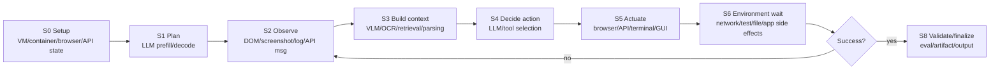

# P0 Agent Flow Trace Collection v0.1

This note scopes P0 to strict agent runtime traces: trajectories generated by an LLM/VLM agent or agent harness, with an action-observation loop and enough step-level evidence to infer hardware-device demand across a flow.

## P0 Source Inventory

| Source | Strict agent flow? | Flow class | Current status | Why it matters for hardware-resource heterogeneity |
|---|---:|---|---|---|
| AgentRewardBench | yes | Web agent | Stable dataset via Hugging Face | Captures web-agent trajectories, repetitions, side effects, and success labels. Useful for browser/network/VLM/LLM phase analysis. |
| tau-bench / tau2 / tau3 | yes | Tool/API conversational agent | tau-bench repository includes historical trajectories; tau3 is the recommended latest benchmark line | Captures tool-call and user-agent interaction loops. Useful as a low-GUI, high-LLM/network/API contrast class. |
| OSWorld / OSWorld-Verified | yes | Desktop/GUI computer-use agent | Public benchmark and verified track; replay cost is higher | Captures real computer tasks across web, apps, file I/O, GUI, and evaluation scripts. Strongest source for cross-device heterogeneity. |
| TerminalTraj | candidate | Terminal/code agent | Claimed large trajectory set, but README says release is pending | If released, it covers Dockerized terminal tasks, CPU/storage/container-heavy execution, and validator-driven flow. |
| OpenHands / SWE-bench logs | candidate | Software-engineering agent | Needs verification of complete public logs | Useful for code-edit/test/debug loops and container resource phases. |
| Harness-Bench | candidate | Sandboxed agent workflow | Paper reports execution traces and usage statistics; artifact availability must be verified | Very aligned with runtime traces and harness effects if public artifacts are available. |

## Flow-Progress Resource View

The hardware view should be stage-based rather than benchmark-based. Each trace source can then be mapped onto the same phase model.

## Stage-to-Hardware Matrix

Legend: L = low, M = medium, H = high, B = bursty/high variance.

| Stage | Accelerator GPU/NPU | CPU | DRAM/HBM | Storage I/O | Network | Browser/display | VM/container | Main evidence sources |
|---|---:|---:|---:|---:|---:|---:|---:|---|
| S0 Setup | L | M | M | M | M | M | H | OSWorld, Terminal/code agents |
| S1 Plan | H | L-M | H | L | L | L | L | all |
| S2 Observe | M for VLM | M | M-H | L-M | M-H | H for web/GUI | M | AgentRewardBench, OSWorld, tau-bench |
| S3 Context build | H for VLM/embed | M-H | H | M | L-M | M-H | M | Web/GUI/code agents |
| S4 Decide action | H | L-M | H | L | L | L | L | all |
| S5 Actuate | L | M-H | M | M-H | M-H | H for web/GUI | H for terminal/desktop | all, modality dependent |
| S6 Wait/side effects | L-M | H for tests | M | H for code/file tasks | H for web/API | M-H | H | tau-bench, OSWorld, terminal/code agents |
| S7 Recover/retry | H | M | H | M | M | M | M | AgentRewardBench, tau-bench, OSWorld |
| S8 Validate/finalize | L-M | M-H | M | M | L-M | L-M | M-H | OSWorld, tau-bench, terminal/code agents |

## Initial Hypotheses for MEMS-Based Reconfigurable Architecture

1. Agent flows are not monolithic LLM workloads. They alternate among accelerator-bound planning/decision, observation-heavy perception, and environment-bound execution.
2. Web/GUI agents should show alternating accelerator/browser/network phases; tool/API agents should show accelerator/network phases with lower display/storage demand; terminal/code agents should show accelerator/CPU/storage/container phases.
3. The recovery loop is likely the largest hidden source of waste. Failed actions repeat S2-S6, producing bursty demand and poor static resource utilization.
4. A Flow/Task-Aware scheduler should allocate resources at stage granularity, not at whole-run granularity.

## Collection Plan for the First Version of Data

1. Download or index stable P0 sources first: AgentRewardBench, tau-bench historical trajectories, and OSWorld verified trajectories if access is straightforward.
2. For each source, parse raw trajectories into a common event schema:
   `run_id, source, task_id, step_id, timestamp, event_type, observation_type, action_type, success, error, retry_flag`.
3. Add hardware proxy fields:
   `prompt_tokens, completion_tokens, screenshot_pixels, html_bytes, network_event_count, tool_call_count, command_count, file_touch_count, eval_runtime_proxy`.
4. Map every event to one of S0-S8 stages and aggregate resource vectors by stage.
5. Produce two plots:
   - stage-resource heatmap by source;
   - per-flow timeline showing dominant device demand over time.

## Data Quality Notes

Most public trajectories will not include direct hardware counters. The first pass should therefore report proxy demand. Replayable subsets should later be rerun under instrumentation to calibrate proxy-to-hardware relationships with CPU time, memory peak, disk bytes, network bytes, GPU/NPU time, and browser/VM overhead.

## Sources Checked

- AgentRewardBench: https://agent-reward-bench.github.io/
- tau-bench: https://github.com/sierra-research/tau-bench
- OSWorld: https://os-world.github.io/
- TerminalTraj: https://github.com/Wusiwei0410/TerminalTraj
- Harness-Bench paper: https://arxiv.org/abs/2605.27922
